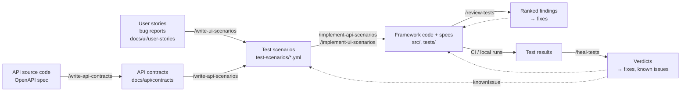

# The AI-driven test automation workflow

SimpRight is built so that AI agents can carry test automation through the whole cycle, from the first description of what the app does to a test that keeps passing:

1. **Describe** the app: API contracts from the API's source code or OpenAPI spec; user stories with acceptance criteria for the UI.
2. **Plan the tests:** test scenarios in YAML, written from the contracts and stories.
3. **Automate:** the framework code each scenario needs (page objects, clients, fixtures, test data) and the specs.
4. **Review** the tests against their scenarios and the project's conventions.
5. **Heal** failing tests: find out why they failed and fix what is the tests' fault.

Each step is a slash command in [Claude Code](https://claude.com/claude-code) that starts a specialised agent. The agents do the work; a person approves it at fixed checkpoints. Nothing is written, no live data is changed and no fix is applied without that approval.



## The commands

| Step | Command | Agent | Input | Output |
|---|---|---|---|---|
| Describe the API | `/write-api-contracts [update] <source> <spec> <areas>` | `api-contract-writer` | The API's source code and/or its OpenAPI spec | Contracts in `docs/api/contracts/`, one per API area |
| Plan API tests | `/write-api-scenarios <contract>` | `api-scenario-writer` | A contract | API scenarios (`API-NNNN`) |
| Plan UI tests | `/write-ui-scenarios <story or bug> [AC ...]` | `ui-scenario-writer` | A user story's acceptance criteria, a bug report | UI scenarios (`UI-NNN`) |
| Automate API tests | `/implement-api-scenarios <IDs \| file \| area>` | `api-test-engineer` | API scenarios | Clients, services, DTOs, fixtures, factories, specs |
| Automate UI tests | `/implement-ui-scenarios <IDs \| file \| area>` | `ui-test-engineer` | UI scenarios | Page objects, components, flows, fixtures, specs |
| Review | `/review-tests [spec \| file \| IDs \| commit]` | `test-reviewer` | Specs and the code they use (default: work not pushed yet) | Findings ranked blocker / should fix / nit |
| Heal | `/heal-tests [run id \| PR \| spec \| IDs]` | `test-healer` | A failed CI run, a PR's checks, the last local run | A verdict per failure, then the approved fixes |

The agents live in `.claude/agents/`, the commands and the skills they use in `.claude/skills/`.

## The steps in detail

### 1. Describe the app

**API contracts.** `/write-api-contracts` reads the API's source code, its OpenAPI spec, or both, and writes one markdown contract per API area: every endpoint, its parameters, request body, responses and error status codes, including the ones no test covers yet. The spec gives the structure; the source gives the real behaviour (validation rules, which role may call what, the error each case returns). Every fact carries its origin:

- `_(verified)_`: checked against the live API (the agent asks before calling it),
- `_(source)_`: read from the source code,
- `_(spec)_`: only in the OpenAPI spec.

Status codes the API returns where it shouldn't (a `500` for an unknown id) are documented as they are and marked as suspected bugs. In `update` mode the agent syncs existing contracts after the API changed, without losing verified facts. The format is in [CONTRACT_FORMAT.md](api/CONTRACT_FORMAT.md); the optional API coverage report measures the tests against these contracts, so the gaps show.

**User stories.** UI tests start from user stories with acceptance criteria in `docs/ui/user-stories/` (or from a bug report or feature description given to the command). They are written by people; the agents read them.

### 2. Plan the tests: scenarios

Scenarios are the single source of truth for what gets automated. Each is a short, readable test case in YAML, validated by a schema:

```yaml
- id: UI-013
  name: The product page shows the product's information and related products
  ref: docs/ui/user-stories/Product_Detail.md#AC1
  status: manual
  steps:
    - Open the product "Combination Pliers".
    - Verify the name "Combination Pliers" is shown.
    - Verify the price "$14.15" is shown.
```

Checks are ordinary steps that start with `Verify`. A scenario can name a `role` (`admin`, `guest` for a logged-out visitor) and a `knownIssue` for behaviour that is a known bug.

The **scenario writers** work in two phases:

1. **Proposal:** the scenarios they would write, one line each, with the cases they left out and why, the questions they couldn't settle, and which scenarios would change data on the live app.
2. **Files:** after the user approves (or edits) the proposal, the YAML files, all with `status: manual`.

The API writer works from a contract: happy paths, every documented error status code, required fields and boundaries, roles. It never calls the API. The UI writer works from acceptance criteria and checks the real page with the **page inspector** (`npm run inspect:ui`), a read-only tool that lists a page's `data-test` elements and accessibility tree, so the steps use the labels and messages the app really shows.

### 3. Automate: framework code and specs

The **test engineers** turn `manual` scenarios into specs, again in two phases:

1. **Plan:** for each scenario file, the spec it becomes, the framework code that exists and what is missing (a page object method, a client, a DTO, a fixture, a test data factory), the locators and the app signals each action will wait for, and the list of **tests that change live data** (creating a product, adding to the cart). The user approves the plan and each of those writes.
2. **Implementation:** the agent adds only the missing pieces, in the style of the project's exemplar files, writes the specs, runs the typecheck and the scenario validator, runs each spec, then repeats it three times to catch flaky tests, and marks the scenarios `automated` with the spec path.

The specs follow the scenario step for step, so the HTML report and the trace read like the scenario:

```ts
// Scenarios: test-scenarios/ui/products/product-search.yml
test.describe('@products - Product search', () => {
  test('UI-001: Search by name shows only matching products', async ({ homePage }) => {
    await test.step('Open the home page.', async () => {
      await homePage.open();
    });
    await test.step('Verify the caption reads "Searched for: pliers".', async () => {
      await expect(homePage.searchCaption, 'The caption names the search term').toHaveText('Searched for: pliers');
    });
  });
});
```

The engineers' rules: the scenario is the specification, so a check is never weakened to make a test pass. When the app behaves differently from the scenario, the test is left failing and reported with a proposal: a `knownIssue` when it's a bug, a scenario fix when the scenario expected something the app never promised. Each engineer uses two helper skills: `api-scaffolding` / `ui-scaffolding` (the framework code) and `api-test-from-scenario` / `ui-test-from-scenario` (the spec).

### 4. Review

`/review-tests` runs the **test reviewer**, a read-only agent that reviews tests the way a senior engineer reviews a pull request. With checklists for both layers (`.claude/skills/review-tests/references/`), it looks for what the typecheck and the validator can't catch:

- a test that doesn't check what its scenario says, or a check that passes on an empty list,
- waits that race the app, fixed sleeps, data shared between parallel tests,
- convention breaks (a selector in a spec, an assertion without a message, a locator outside its page object),
- live data written without approval or cleanup, secrets that could leak into the public reports.

Every finding has a file and line, the code, what goes wrong and when, the rule it breaks and a concrete fix. The user picks the findings to apply; the main session applies them and re-runs the affected specs. The reviewer never edits anything itself, so it stays independent of the fixes.

### 5. Heal

`/heal-tests` runs the **test healer** on failed tests: a CI run, a pull request's checks, or the last local run. Its job is to find out **why** a test failed before anyone changes code, because on a live app a test fails for many reasons that aren't the test's fault.

1. **Diagnosis (read-only):** from the CI log or the local results (errors, page snapshots, traces), the code history, the page inspector, read-only `GET` calls to the API and re-runs of read-only tests, each failure gets a verdict with its evidence and a confidence level:

   | Verdict | Meaning | Proposed action |
   |---|---|---|
   | Test defect | The test code is wrong | The code fix |
   | Flaky | Passes and fails on the same code | Fix the cause (a wait, shared data); never retries or sleeps |
   | App changed | The app changed on purpose | Update the page object or client; scenario changes go to the user |
   | App bug | The app breaks what the scenario promises | A `knownIssue` and a short bug note |
   | Data drift | The test's data changed under it (another visitor, a re-seed) | Make the test create its own data |
   | Environment | The site was slow or down for a while | A re-run, no code change |

   It also reports records a failed cleanup may have left on the live app.
2. **Fixes:** the user picks which causes to fix; the same agent applies them, runs the specs and repeats them, and reports.

Unlike a healer that edits tests until they pass, it never weakens a check, never skips a test and never adds retries: a test made green while the app is broken is the worst outcome. The demo site's known transient problems (its hourly re-seed, a cached endpoint, slow periods, data other visitors change) are listed in the project profile, so the healer can tell them from real failures.

## What keeps the agents on track

- **Checkpoints.** Every agent that writes works in two phases: a proposal or plan, then the work after the user's approval. Agents can't ask questions mid-run, so open questions go into the proposal.
- **One source of truth per step.** Contracts describe the API, stories the UI, scenarios the tests. Writers never write test code; engineers never change a scenario's steps; reviewers and healers judge tests against their scenarios.
- **A project profile, not built-in knowledge.** The agents keep no facts about SimpRight. They read [`qa-agents-profile.yml`](../qa-agents-profile.yml): paths, commands, scenario ID rules, roles, exemplar files to copy the style of, layer rules and the live-app guardrails. The prose conventions stay in [CLAUDE.md](../CLAUDE.md). Pointing the agents at another project means writing its profile.
- **Live-app guardrails.** `liveApi.writes: ask` means any test or check that creates, changes or deletes data on the live app runs only after the user approved it; `liveApi.dangerous` lists what never runs (such as repeated failed logins that lock an account). Tests remove what they create through a `cleanup` fixture.
- **Deterministic checks.** The agents' work is checked by code, not only by review: `npm run typecheck`, `npm run validate:scenarios` (schema, IDs, file names, spec titles and the link between each scenario and its test), and the contract validator from the coverage package.
- **Safe reports.** Attachments and assertion messages mask passwords, tokens and test users' emails, because the HTML reports are published.

## A typical cycle

For a new API area:

```text
/write-api-contracts ../app/api carts        → docs/api/contracts/Carts_API.md
/write-api-scenarios Carts_API.md            → proposal → approve → test-scenarios/api/carts/*.yml
/implement-api-scenarios carts               → plan + writes → approve → specs, all passing
/review-tests                                → findings → pick → fixes applied
(commit, pull request, CI)
/heal-tests PR <n>                           → if CI fails: verdicts → pick → fixes or re-run
```

For a new UI story:

```text
/write-ui-scenarios Product_Detail.md        → proposal → approve → test-scenarios/ui/products/*.yml
/implement-ui-scenarios product-detail.yml   → plan + writes → approve → page objects, specs
/review-tests product-detail.spec.ts         → findings → pick → fixes applied
```

The person in the loop decides what to test and approves each step; the agents do the reading, writing, running and checking in between.
